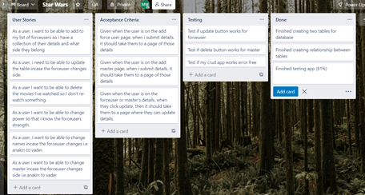
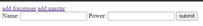

# firstproject

* [App Description](#app-description)
* [Requirements](#requirements)
* [Database](#database)
* [Project Tracking](#project-tracking)
* [Testing](#testing)
* [Application](#application)
* [CommonProblems](#common-problems)
* [License](#license)

# App-Description

My README.md contains appropiate documentation for my fundamental project. My project was to create a CRUD application using Project Management, Python Fundamentals, Python Testing, Git, Basic Linux, Python Web Development, Continuous Integration, Cloud Fundamentals, Databases
My app contained two tables called 'ForceUsers' and 'Masters'. The objective was to link a forceuser(anakin, luke) to a master(yoda, obi-wan).
ForceUsers contained:
Name
Power

Master contained:
Name
Side
Force_users.id

I want the user to be able to add and view forceusers, masters and delete, update them as well.

# Requirements

The creation of my app required the use of:
- Trello Board with user stories
- Relational databases with a relationship between at least two tables
- Clear documentation from a design phase describing architecture I will use for my project.
- Functional CRUD app created on Python using acceptable standards and design principles
- Fully designed test suites, as well as automated tests for validation and high test coverage for backend
- a functional front end website using Flask
- Fully integrated code into a Version Control System using Feature Branch

# Database

As you can see above, my entity relationship diagram clearly shows the structure of my database. It displays what has been implemented into my database as well. My database conveys a one to many relationship. This is because the user can create forceusers and link it to multiple masters.

Pictured above is the CI Pipeline with the related systems and services that I've used to create my project. Using this model has allowed me to rapidly develop, automate and complete tasks. For example, using Jenkins means I can automate tests. Any new code will automatically be pushed to Jenkins from Github using a webhook.

# Project Tracking

In the above picture, I used Trello for my Kanban board to track my project accordingly and meet the MVP requirements. It helped me with procrastination and meeting deadlines.

# Testing

In the above picture, you can see the result of my testing of my application, which has provided an acceptable test coveragae result of 81%. Hopefully, with a few fixes, I can make my app flawless in the future

# Risk Assessment

In the above picture, you can see my detailed risk assessment in which I have outlined the most common and neccessary risks I may bump into. Ultimately, it is my responsibility that I make sure I minimize risk to a minimum impact on my project.

# Application

In the above picture, we can see the home page that the user will see when going to my website. To add a forceuser or master, they can click on the buttons on the top.

 

In the above picture, we can see the add forceuser page which allows me to add different characters from both sides of the Force, i.e Anakin or Vader.

In the above picture, we can see the Add function being utilised as we can see a force user and master.

In the abOve picture, we can see the Delete function being used as I have removed the master.

In the above pictures, we can see the Update function being used to update forceuser to masters. 

# Common Problems

There's no authentication and authorisation set up.
There is no current protection from hacking attacks.
My data is not encrypted.

# License

MIT License

Copyright (c) 2022 Marko Matambu

Permission is hereby granted, free of charge, to any person obtaining a copy
of this software and associated documentation files (the "Software"), to deal
in the Software without restriction, including without limitation the rights
to use, copy, modify, merge, publish, distribute, sublicense, and/or sell
copies of the Software, and to permit persons to whom the Software is
furnished to do so, subject to the following conditions:

The above copyright notice and this permission notice shall be included in all
copies or substantial portions of the Software.

THE SOFTWARE IS PROVIDED "AS IS", WITHOUT WARRANTY OF ANY KIND, EXPRESS OR
IMPLIED, INCLUDING BUT NOT LIMITED TO THE WARRANTIES OF MERCHANTABILITY,
FITNESS FOR A PARTICULAR PURPOSE AND NONINFRINGEMENT. IN NO EVENT SHALL THE
AUTHORS OR COPYRIGHT HOLDERS BE LIABLE FOR ANY CLAIM, DAMAGES OR OTHER
LIABILITY, WHETHER IN AN ACTION OF CONTRACT, TORT OR OTHERWISE, ARISING FROM,
OUT OF OR IN CONNECTION WITH THE SOFTWARE OR THE USE OR OTHER DEALINGS IN THE
SOFTWARE.